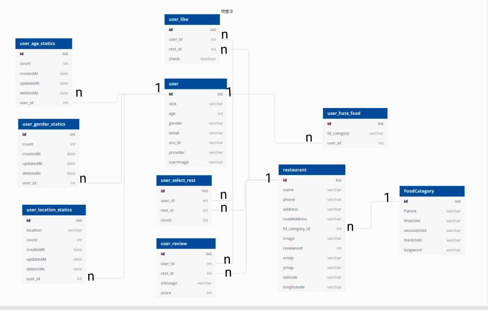

# MukBank-Server

## config 설정

env_fomat 파일을 .env로 변경뒤에 각 항목들의 key 값들을 채워놓는다.

## DB 스키마 

## api 문서

[api 문서](https://docs.google.com/document/d/1kWHbf8rqpopScbrCbGnFZ_C_q-G5fcjgIA7nCddCbEc/edit?usp=sharing)
 
## 앱 설명

[먹뱅크 서비스 발표 자료](https://docs.google.com/presentation/d/1CSSSBwvnrOh2XsKuttKzYL_WD6L_uYGFxW7P47lcBz8/edit?usp=sharing)